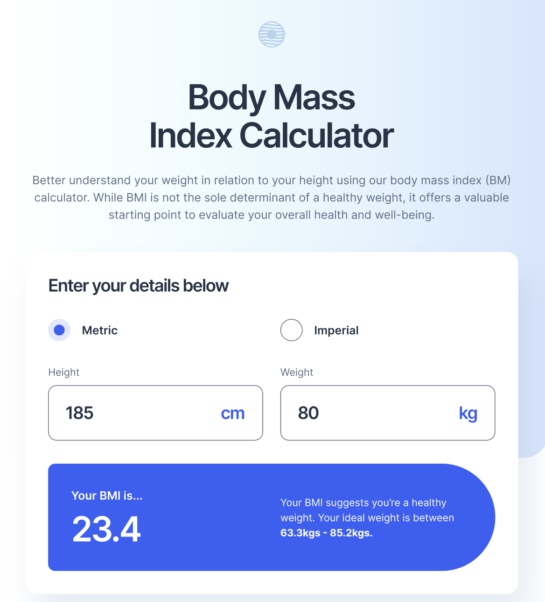

# 🧮 Body Mass Index (BMI) Calculator

A modern and responsive **BMI Calculator Web Application** built with **HTML, SASS (7-1 architecture), and JavaScript**.  
This app allows users to easily calculate their Body Mass Index and provides useful insights into maintaining a healthy lifestyle through diet, regular exercise, and sleep.



---

## ✨ Features

- 📊 **BMI Calculation**: Enter your weight and height to get instant BMI results.
- 📱 **Responsive Design**: Fully optimized for desktop, tablet, and mobile devices.
- 🎨 **SASS 7-1 Architecture**: Clean, scalable, and maintainable styling approach.
- 🧾 **Lifestyle Tips**: Personalized information on healthy eating, exercise, and sleep.
- 🌍 **Cross-browser Support**: Works seamlessly across modern browsers.

---

## 🛠️ Technologies Used

- **HTML5** – Semantic markup
- **SASS (7-1 pattern)** – For scalable, modular, and maintainable stylesheets
- **JavaScript (ES6+)** – For interactive BMI calculation logic
- **Responsive Design** – Mobile-first approach

---

## 🚀 Live Demo

🔗 [View Demo on Vercel](https://bmi-calculator-gilt-six.vercel.app/)

---

## 📂 Project Structure

SASS follows the **7-1 architecture** pattern:

sass/
│
├── abstracts/ # Variables, functions, mixins
├── base/ # Reset, typography, global styles
├── components/ # Buttons, cards, widgets
├── layout/ # Header, footer, navigation, grid
├── pages/ # Page-specific styles
├── themes/ # Theme-related files (if any)
├── vendors/ # External libraries
└── main.scss # Main file importing everything

---

## ⚙️ Installation & Usage

1. Clone the repository:
   ```bash
   git clone [https://github.com/your-username/bmi-calculator.git](https://github.com/khamzaevasad/bmi-calculator?tab=readme-ov-file)
   ```

cd bmi-calculator

open index.html

📖 How It Works

Select Metric or Imperial units.

Enter your height and weight.

Instantly see your BMI result along with lifestyle tips.

Explore additional guidance on nutrition, exercise, and sleep.

👨‍💻 Author

Developed with 😎 by Asadbek

📜 License

This project is licensed under the MIT License – feel free to use, modify, and share
